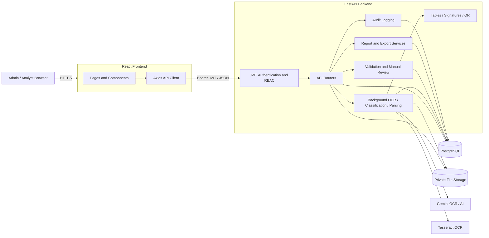

# Architecture

Uploads remain private backend files and are never mounted by the frontend or FastAPI as a public directory. In production, private object storage is recommended in place of local disk.
