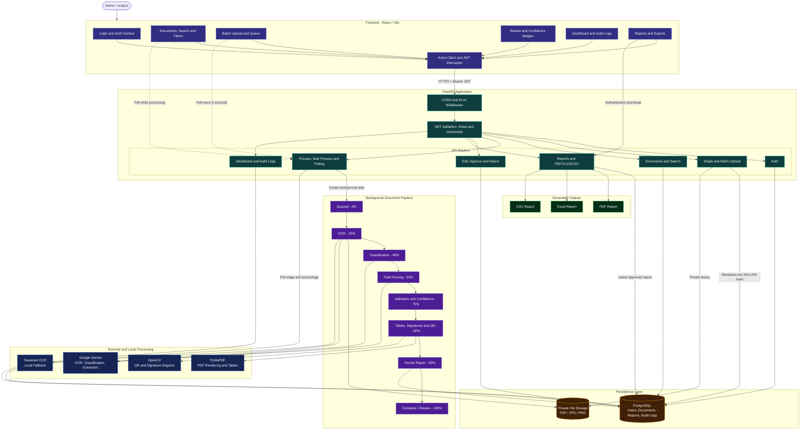
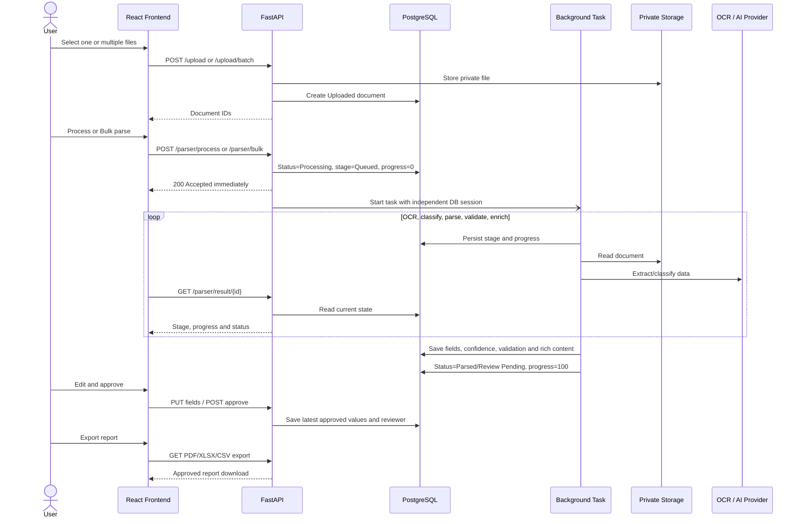
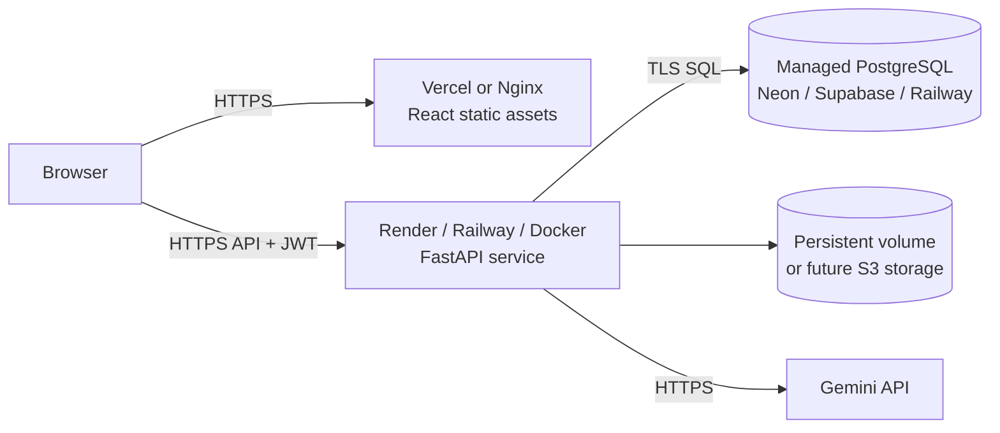

# System Architecture

The application uses a React single-page frontend, a modular FastAPI backend, PostgreSQL, private document storage, and pluggable OCR/AI providers. Parsing runs after the HTTP response through FastAPI background tasks; the browser polls persisted progress.

## Processing sequence

## Deployment mapping

FastAPI `BackgroundTasks` provides immediate responses without an additional broker, but jobs are tied to the backend process. A production-scale evolution would replace this boundary with Celery/RQ workers and Redis while retaining the same persisted progress and polling contract.
