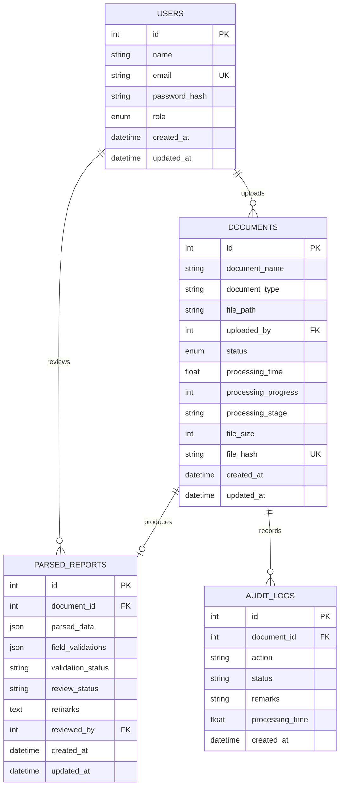

# Database Schema

`file_hash` prevents duplicate content at the database level. `parsed_data` stores the classified document type, raw OCR text, and latest extracted fields. `field_validations` stores per-field `valid`, `invalid`, or `missing` results.
